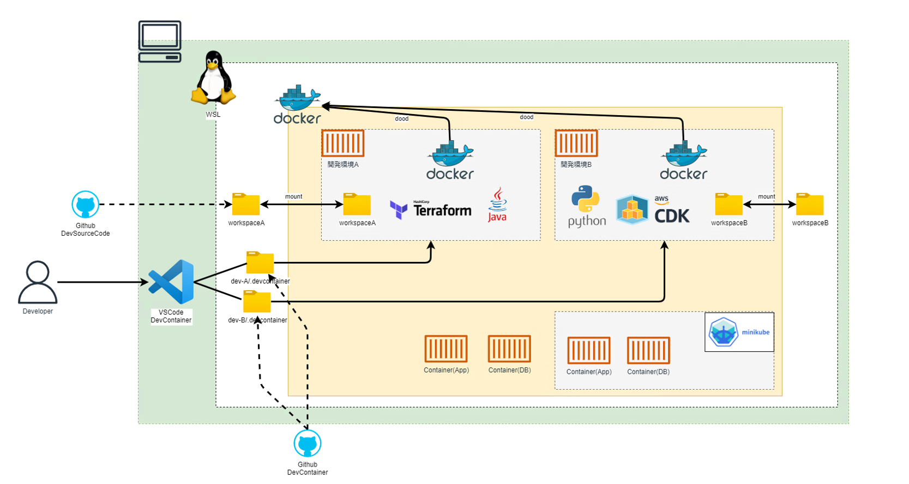

# flexible-devcontainer

## 概要

`flexible-devcontainer`は、VSCodeの拡張機能であるDevContainerを活用し、開発環境の構築を自動化し、全ての利用者が同じ開発環境を使えるようにするためのツールです。独自のコンテナのベースイメージやFeaturesを提供することで、一般公開されているベースイメージやFeaturesで解決できないソフトウェアのインストールや開発環境の運用課題を解決し、開発標準環境として配布可能にします。  

### DevContainerについて
  

[画像引用元：公式サイト]

DevContainer（開発コンテナ）は、開発環境をコンテナ化するためのVSCodeの拡張機能です。DevContainerを利用することで以下のような効果が期待できます。 
+ **開発環境の構築時間を大幅に削減**：環境構築の構築時間や、手順書・設計書の作成コストを削減します  
+ **一貫した開発環境の提供**：プロジェクトごとに同じツールセットと設定を使用でき、環境の違いや設定ミスによる問題を減少させます  
+ **独立した開発環境の提供**：異なるプロジェクト間で依存関係が競合することを防ぎ、環境の汚染を回避できます  

また、DevContainerのFeaturesは、開発コンテナに追加機能やツールを簡単にインストール・設定するための仕組みです。DevContanerについての詳細ついては[公式サイト](https://code.visualstudio.com/docs/devcontainers/containers)を参照してください。 

### flexible-devcontainerの前提条件
以下の前提条件は厳密にはDevContainerおよびflexible-devcontainerの必須条件ではありませんが、有償ライセンス無しでの環境利用や、別途まとめている環境構築手順の前提となっています。  
+ WSL (Ubuntu)  
+ WSL環境へのDocker Engineのインストール（Apache Licenseで利用可能）  

### flexible-devcontainerの利用イメージとポイント

+ WSL上に`flexible-devcontainer`をgitからクローンし、VSCodeからコンテナにアクセスするだけで簡単に利用できます  
+ WSL上のソースコードのディレクトリをマウントし、Dockerコンテナのライフサイクルに関わらず永続化して開発を進められます  
+ コンテナ内で利用するDockerはWSL上のDockerエンジンを利用するDooD（Docker outside of Docker）で実現し、リソース消費を少なくします  

### flexible-devcontainerが提供する独自のコンテナのベースイメージとFeatures
コンテナのベースイメージ、FeaturesにはDevContainerの公式が公開しているものがありますが、flexible-devcontainerが提供する独自のベースイメージ、Featuresには以下のような特徴があります。

#### コンテナベースイメージの特徴
一般的に必要とされるユーティリティソフトやDocker開発環境(DooD)などを選定・セットアップした環境をベースイメージとして提供します。これにより、プロジェク毎に必要なソフトのインストールをFeaturesでコントロールするだけで直ぐに開発を始める事ができます。

+ ユーティリティソフトのインストール（[ユーティリティソフト](#ユーティリティソフト)参照）
+ ルート証明書のインストール機能（社用プロキシで証明書が必要な場合などに活用）  
  + Ubuntuにルート証明書をインストールすることで、対応しているソフトウェアは証明書を自動的に参照します
  + VSCodeの拡張機能の自動インストールに証明書が必要な場合の対策として、環境変数「NODE_EXTRA_CA_CERTS」に証明書を設定しています
+ Docker開発環境（Docker Client、DooD（Docker outside of Docker））
+ systemdのインストールと有効化

#### Features(選択インストール可能なソフトウェア)の主な特徴
+ Featuresとして提供しているソフトウェア  
[利用可能なソフトウェア](#利用可能なソフトウェア)参照。近年の開発で利用したソフトウエアをピックアップしてFeaturesとして提供しています。このプロジェクトで管理しているFeaturesは、タイマーを使用して定期的にテストを実行します。これにより、ソフトウェア提供元の提供方法の変更などによる不具合を検知し、メンテナンスを行うことで品質を確保します  
+ DooD対応  
一般公開されているFeaturesはDooD環境下ではインストールエラー、または動作しない可能性がありますが、flexible-devcontainerは対応しています。
+ ルート証明書のインストール対応  
一般公開されているFeaturesはルート証明書が必要なプロキシ環境下では、インストールエラー、または実行時エラーとなる可能性がありますが、flexible-devcontainerは対応しています。
+ ユーザーのホームディレクトリの保護  
DevContainerでは環境の再構築などでユーザーのホームディレクトリが初期化されてしまいますが、flexible-devcontainerでは設定ファイルのパスをワークスペースに変更することで設定ファイルを保護します。
※DevContainerには[Personalizing with dotfile repositories](https://code.visualstudio.com/docs/devcontainers/containers#_personalizing-with-dotfile-repositories)機能がありますが、認証情報など秘匿情報はリポジトリで管理すべきではありません。利用時には内容を考慮して利用してください。
+ バージョン指定  
ソフトウェアのバージョン指定方法を統一（インストーラーの仕様や制限によって一部個別仕様あり。

### 利用可能なソフトウェア

| ソフトウェア名 | デフォルトバージョン | VSCode拡張機能 | ルート証明書 | 備考 |
| ---- | ---- | ---- | ---- | ---- |
| ArgoCD CLI | v2.x.x | - | - | - |
| Azure CLI | 最新 バージョン | - | az cliに同封されているPythonのcertifiに証明書をインストール | 認証情報のディレクトリ： ~/workspace/.azure |
| AWS CLI | 最新 バージョン | - | - | 認証情報のディレクトリ： ~/workspace/.aws |
| Docker | ホストに導入するDockerと同じ | - | - | - |
| Golang | 1.x.x | golang.go | - | - |
| Java(Temurin) | 21.x.x.x | vscjava.vscode-java-pack | Javaのキーストアに 証明書をインストール | - |
| Helm | 3.x.x | - | - | - |
| kubectl | v1.31.x | ms-kubernetes-tools.vscode-kubernetes-tools | - | 設定ファイルのパス： ~/workspace/.kube/config エイリアス設定：k="kubectl"、kd="kubectl describe " |
| Minikube | v1.x.x | ms-kubernetes-tools.vscode-kubernetes-tools | [環境構築手順参照](環境構築手順.md) | - |
| Maven | 3.9.9 | - | - | 設定ファイルのパス： ~/workspace/.m2/settings.xml |
| Node.js | v22.x.x | - | 環境変数NODE_EXTRA_CA_CERTSに証明書を設定 | - |
| OpenAPI Generator | 2.x.x | - | - | - |
| Python | 3.12.5 | ms-python.python ms-python.flake8 ms-python.black-formatter | pip configの「global.cert」に証明書を設定 | - |
| skaffold | 最新 バージョン | - | - | - |
| Terraform | v1.x.x | hashicorp.terraform | - | - |

※3.x.xのような表記はマイナーバージョンおよびパッチバージョンが最新になります  
※ソフトウェア固有の設定ファイルの管理場所をユーザーのホームディレクトリからワークスペースに変更している場合は備考欄に記載しています。  
※ルート証明書欄には、Ubuntuへの証明書インストールによって追加対応が不要なものは「-」と記載しています。

### ユーティリティソフト

+ curl
+ dig(dnsutils)
+ git
+ jq
+ lsof
+ netstat(net-tools)
+ ping(iputils-ping)
+ ssh
+ sudo
+ systemd
+ unzip
+ vim
+ wget

## [環境構築手順](環境構築手順.md)

## [開発環境利用手順](開発環境利用手順.md)

## ライセンス

本プロジェクトは、[Apache-2.0](LICENSE) ライセンスの下でライセンスされています。
